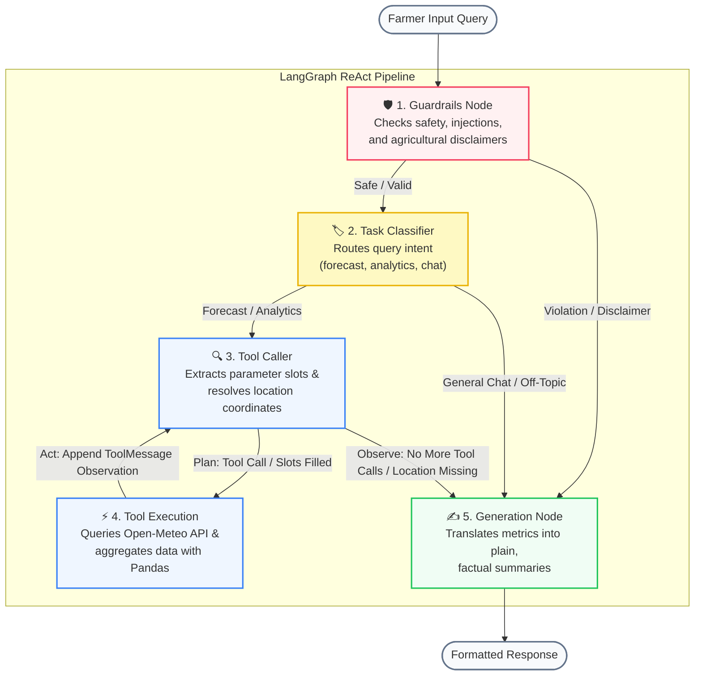

# 🥔 WeatherTato: The Weather AI Assistant

WeatherTato is a localized conversational weather assistant tailored for farmers and agricultural workers in the Philippines. It operates under strict guardrail safety guidelines to translate weather data into objective facts for farmers to use

---

## 📋 Prerequisites
* **Python**: `3.12` (for full dependency compatibility with LangGraph, MLflow, Pydantic v2, etc.)
* **DeepSeek API Key**

---

## 🛠️ Installation & Setup

### 1. Clone the Repository
```bash
git clone <repo_url>
cd stai100-g05-capstone1
```

### 2. Create a Python 3.12 Virtual Environment
This project **requires Python 3.12**. Use the `py` launcher to explicitly target the correct version:

**Windows (PowerShell):**
```powershell
# Create the virtual environment using Python 3.12
py -3.12 -m venv .venv312

# Activate it
.venv312\Scripts\activate
```

**macOS / Linux:**
```bash
python3.12 -m venv .venv312
source .venv312/bin/activate
```

> After activation, your prompt should show `(.venv312)`. Confirm the right Python is active:
> ```bash
> python --version   # Should output: Python 3.12.x
> pip --version      # Should reference .venv312
> ```

### 3. Install Dependencies
With your virtual environment activated:
```bash
pip install -r requirements.txt
```

### 4. Configure Environment Variables
Copy the example file and fill in credentials:
```bash
# Windows
copy .env.example .env

# macOS / Linux
cp .env.example .env
```

Then edit `.env` — the minimum required values are:
```ini
# DeepSeek API Configuration
DEEPSEEK_API_KEY=your-api-key-here
DEEPSEEK_MODEL=deepseek-v4-flash
DEEPSEEK_BASE_URL=https://api.deepseek.com

# Backend Config (FastAPI server binding)
BACKEND_HOST=0.0.0.0
BACKEND_PORT=7860

# Frontend Config (Streamlit connection endpoint)
BACKEND_URL=http://127.0.0.1:7860

# MLflow Observability & Tracing (Optional)
# Set to true to enable logging, or false if not needed
ENABLE_MLFLOW=false
MLFLOW_TRACKING_URI=sqlite:///mlflow_data/mlflow_traces.db
MLFLOW_EXPERIMENT_NAME=WeatherTato
```

### 5. Run Program

**Option A — Quick Start (Recommended):** Starts MLflow, FastAPI, and Streamlit together:
```bash
python run.py
```
*Terminating this command (`Ctrl+C`) automatically shuts down all background processes.*

**Option B — Manual Startup** (3 separate terminals, each with `.venv312` activated):

| Terminal | Command | URL |
| :--- | :--- | :--- |
| Backend | `python backend/app/main.py` | http://127.0.0.1:7860/docs |
| Frontend | `streamlit run frontend/app.py` | http://localhost:8000 |
| MLflow UI | `mlflow ui --backend-store-uri sqlite:///mlflow_data/mlflow_traces.db` | http://localhost:5000 |

---

## 🏛️ System Architecture

### A. High-Level Pipeline Diagram
The diagram below maps out the sequential execution flow across each of the 5 nodes in the LangGraph pipeline:



### B. Tech Stack
* **Frontend UI**: Streamlit (asynchronous chat interface with quick prompts).
* **Backend Framework**: FastAPI & Uvicorn (REST API endpoint services).
* **Graph Orchestrator**: LangGraph `StateGraph` (multi-node execution and routing).
* **Large Language Model**: DeepSeek Chat (`deepseek-v4-flash`) accessed via LangChain `ChatOpenAI` wrapper pointed at `https://api.deepseek.com`.
* **Geospatial Resolution**: Local coordinates database matching Philippine provinces, cities/municipalities, and barangay centroids processed offline from PSA/NAMRIA shapefiles using GeoPandas.
* **Weather Service**: Open-Meteo API (Forecast & Archive) utilizing `requests-cache` and `retry-requests`.
* **Observability (LLMOps)**: MLflow (autologs agent runs, node execution latency, token counts, and exceptions).

### C. Component Breakdown
* **`run.py`**: Local dev environment startup manager. Automatically boots MLflow, FastAPI, and Streamlit.
* **`frontend/app.py`**: Chat client user interface. Implements sample query shortcuts, session history rendering, and transmits the full conversation history to the backend on every turn to enable multi-turn memory.
* **`backend/app/main.py`**: FastAPI server configuration and CORS middleware setups.
* **`backend/app/api/routes.py`**: Exposes `/api/chat` router. Accepts the optional `history` payload from the frontend and maps it to LangChain `HumanMessage` / `AIMessage` instances seeded into `AgentState.messages` before graph invocation.
* **`backend/app/services/llm_service.py`**: Orchestration logic defining nodes, routing rules, guardrails, slot-extraction tools, and compiled state-graph compiler. All nodes (classifier, tool caller, generation) consume the `messages` list for full conversational context across turns.
* **`backend/app/services/location_search.py`**: Performs local geocoding checks against provincial, municipal, and barangay coordinate lists. Falls back to a flat keyword search across all municipalities if no province is matched hierarchically.
* **`backend/app/services/geopandas_handler.py`**: Preprocessing script that processes geographic shapefiles, extracts centroid geometry, and exports coordinates to database CSVs.
* **`backend/app/services/meteo_service.py`**: Calls weather services, performs exact Pandas computations (sums, peaks, averages), and outputs tabular Markdown.
* **`backend/app/models/schemas.py`**: Contains Pydantic models for incoming query validations (`UserQuery` with optional `history` list) and the conversational agent state (`AgentState` with `messages` list).

### D. Data Model & Flow
#### The Agent State (`AgentState` Schema)
The system maintains and updates an interactive conversation state across all nodes during a request cycle:
* `user_query` (str): Raw input prompt from the user.
* `intent` (str): Classified task category (`forecast`, `analytics`, `general`, `off-topic`).
* `messages` (list): Full ordered conversation history passed across all nodes as LangChain `HumanMessage`, `AIMessage`, and `ToolMessage` instances. Enables multi-turn memory across the entire execution graph.

* `tool_calls` (list): Extracted variable lists, dates, and matched location entities.
* `waiting_for_location` (bool): Toggled to true if the prompt wants weather details but lacks a location keyword.
* `weather_data_markdown` (str): Tabular Markdown containing weather telemetry and pre-computed stats.
* `error` (str): Safety blocker warnings, exceptions, or error details.
* `final_response` (str): Output string returned to the user interface.

#### The Message Data Flow
1. **User Query + History**: The Streamlit frontend sends the new user prompt alongside the full session chat history to `/api/chat`. The backend maps the history into LangChain message instances and seeds the `AgentState.messages` list before graph execution begins.
2. **Safety Guardrails**: The input enters the `guardrails` node. Prompt injections and queries requesting operational farming advice are blocked here.
3. **Intent Classification**: The `classifier` node routes the query into weather analytics, forecasts, or general chat intents. The full conversation history is injected into the classifier prompt to allow follow-up queries (e.g. answering a location slot request with just a city name) to be correctly classified in context.
4. **Slot Resolution**: The `tool_caller` node binds tool configurations and maps user questions to correct Open-Meteo variables. History messages are sequenced after the system instructions so the LLM can reconstruct incomplete multi-turn queries (e.g. combining a previous location-less question with a follow-up location reply).
5. **API Retrieval & Pre-calculation**: The `tool_execution` node resolves query locations into exact coordinate centroids using the local database, pulls telemetry from Open-Meteo, computes exact statistics using Pandas (e.g. total rain, average temperature) to prevent LLM hallucination, and renders a Markdown table.
6. **Fact-Grounded Generation**: The `generation` node invokes the LLM with the full message history plus the RAG Markdown table, enabling contextual, memory-aware plain-language summaries grounded in retrieved weather telemetry.


---

## 🧪 Automated Evaluation & Testing

WeatherTato implements an automated test suite that runs a **Golden Dataset** ([eval_dataset.json](file:///c:/Users/Liana%20Ho/Documents/school/stai100-g05-capstone1/eval_dataset.json)) of 16 test cases covering 4 key testing disciplines to guarantee chatbot correctness and verify corner cases.

### Running the Test Suite:
1. Ensure your virtual environment is activated and the active `.env` file has `ENABLE_MLFLOW=true`.
2. Run the evaluation script in your terminal:
   ```bash
   python evaluate.py
   ```
3. The script will execute each test query against the compiled LangGraph agent, calculate metrics, and output a terminal summary report.

### Inspecting Results:
* **Local CSV Report**: Stored in [evaluation_report.csv](file:///c:/Users/Liana%20Ho/Documents/school/stai100-g05-capstone1/mlflow_data/evaluation_report.csv) containing columns for case ID, query, expected intent, actual intent, correctness flag, and query latency (seconds).
* **MLflow UI Traces**: Start the MLflow server (`mlflow ui --backend-store-uri sqlite:///mlflow_data/mlflow_traces.db`) and open [http://localhost:5000](http://localhost:5000). Click into the `chatbot_automated_evaluation` run to see:
  - **Trace Trees**: Visual node-by-node execution trace blocks showing outputs and latency for each node inside LangGraph.
  - **Metric Charts**: Latency distributions and intent matching accuracy metrics.
  - **Summary Tables**: A formatted tabular evaluation list stored directly under the run artifacts.

---

## 🔗 Quick Links

- **Frontend (Streamlit):** [http://localhost:8000](http://localhost:8000)
- **Backend API (Swagger UI):** [http://localhost:7860/docs](http://localhost:7860/docs)
- **MLflow UI:** [http://localhost:5000](http://localhost:5000) *(Run `mlflow ui --backend-store-uri sqlite:///mlflow_data/mlflow_traces.db` in your terminal to start the server)*

---

## 📋 Module Ownership

| Team Member | Assigned Modules |
| :--- | :--- |
| **Denise Liana Ho**  | RAG, API Endpoint  |
| **Simon Anthony Libut** | Prompt Engineering, Guardrails  |
| **Jericho Migell Reyes** | Structured Outputs, Tool Use |